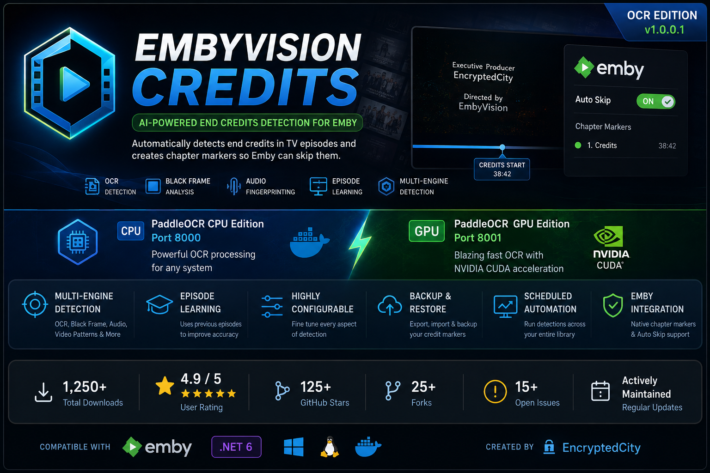

<div align="center">



# EmbyVision Credits

### AI-Powered End Credits Detection for Emby

**Automatically detect end credits, create Emby chapter markers, and make your library ready for Auto Skip.**

[](https://github.com/encryptedcity/EmbyVision-Credits/releases)
[](https://github.com/encryptedcity/EmbyVision-Credits/releases)
[](https://github.com/encryptedcity/EmbyVision-Credits/stargazers)
[](https://github.com/encryptedcity/EmbyVision-Credits/network/members)
[](https://github.com/encryptedcity/EmbyVision-Credits/issues)
[](https://dotnet.microsoft.com/)
[](https://emby.media/)

**Created by [EncryptedCity](https://github.com/encryptedcity)**

</div>

---

# 🎬 EmbyVision Credits

**EmbyVision Credits** is an advanced end-credits detection plugin for **Emby Server**.

Instead of relying on a single detection method, EmbyVision combines multiple detection technologies to determine where end credits begin and creates an Emby-compatible chapter marker at the detected location.

This allows Emby's chapter and Auto Skip functionality to automatically skip end credits.

Designed for both **live-action television and anime**, EmbyVision Credits provides configurable detection methods, external OCR support, episode learning, scheduled processing, rules, backups, diagnostics, and hardware acceleration.

---

## ✨ Features

### 🔍 Multiple Detection Engines

EmbyVision Credits can combine multiple detection signals to improve reliability:

* 🧠 **PaddleOCR**
* 🖥️ **PaddleOCR CPU**
* 🚀 **PaddleOCR GPU / CUDA**
* 🔤 **Tesseract OCR**
* ⬛ **Black Frame Detection**
* 🎵 **Audio Analysis**
* 🎧 **Chromaprint / Audio Fingerprinting**
* 📊 **Character Density Detection**
* 🎞️ **Video Pattern Analysis**
* 🎬 **Scene / Transition Analysis**
* 📜 **Scrolling Credit Detection**
* 🔎 **Keyword Detection**
* 🧩 **Fuzzy Keyword Matching**
* 🧠 **Episode Comparison / Learning**

---

# 🚀 OCR Edition

The OCR Edition uses a separate **EncryptedCity EmbyVision OCR** service for PaddleOCR processing.

Keeping OCR outside of Emby allows the heavy OCR workload to run independently from the Emby Server process.

### OCR Architecture

```text
                    ┌─────────────────────────┐
                    │       Emby Server       │
                    │                         │
                    │   EmbyVision Credits    │
                    │        Plugin            │
                    └────────────┬────────────┘
                                 │
                                 │ HTTP OCR API
                                 ▼
                    ┌─────────────────────────┐
                    │  EncryptedCity OCR      │
                    │       Service           │
                    └────────────┬────────────┘
                                 │
                       ┌─────────┴─────────┐
                       │                   │
                       ▼                   ▼
                ┌─────────────┐     ┌─────────────┐
                │ CPU Edition │     │ GPU Edition │
                │   Port 8000 │     │   Port 8001 │
                │             │     │ CUDA / NVIDIA│
                └─────────────┘     └─────────────┘
```

---

# ⚡ CPU and GPU OCR

| Edition         |   Port | Acceleration | NVIDIA GPU     |
| --------------- | -----: | ------------ | -------------- |
| **CPU Edition** | `8000` | CPU          | ❌ Not required |
| **GPU Edition** | `8001` | CUDA         | ✅ Required     |

### CPU

```text
http://YOUR-OCR-SERVER:8000
```

### GPU

```text
http://YOUR-OCR-SERVER:8001
```

The GPU edition requires a compatible NVIDIA GPU, NVIDIA drivers, and NVIDIA Container Toolkit.

---

# 🧠 Intelligent Detection

EmbyVision Credits does more than simply look for the word "credits."

Depending on configuration, the detection pipeline can use:

```text
OCR
 ↓
Keyword Analysis
 ↓
Character Density
 ↓
Black Frame Analysis
 ↓
Audio Analysis
 ↓
Video Pattern Analysis
 ↓
Episode Comparison
 ↓
Confidence / Validation
 ↓
Credits Start
 ↓
Emby Chapter Marker
```

Multiple detection techniques can work together to reduce false positives and improve detection across different types of media.

---

# 📺 Emby Integration

Detected credits are written as **Emby chapter markers**.

This allows Emby to use its existing chapter and Auto Skip functionality.

Features include:

* ✅ Automatic credit chapter creation
* ✅ Manual detection
* ✅ Scheduled detection
* ✅ Series processing
* ✅ Season processing
* ✅ Episode processing
* ✅ Queue management
* ✅ Existing marker detection
* ✅ Marker validation
* ✅ Thumbnail generation
* ✅ Auto Skip exclusions
* ✅ Per-series configuration
* ✅ Library-wide processing

---

# 🧪 Dry Run & Debugging

Before changing your library, you can run detection in **Dry Run** mode.

Dry Run allows you to evaluate detection without immediately applying markers.

Additional diagnostic tools include:

* Dry Run
* Dry Run Debug
* Tracer
* Detection logs
* OCR diagnostics
* Failed episode tracking
* Progress monitoring

These tools make it much easier to determine why a particular episode was or wasn't detected.

---

# 🎯 Episode Learning

EmbyVision Credits can use previously processed episodes to help determine where credits are likely to begin.

For example, if multiple episodes in the same season consistently place their credits around a similar portion of the runtime, that information can be used to narrow the search area for future episodes.

Benefits include:

* Faster processing
* Smaller search windows
* Less unnecessary OCR
* More consistent results

---

# 🎌 Anime Detection

Anime often uses different credit structures than live-action television.

EmbyVision Credits includes detection methods that are particularly useful for anime, including:

* Black-frame detection
* Character-density analysis
* OCR
* Credit keyword detection
* Video-pattern analysis
* Adaptive frame sampling

These methods can be combined to handle different anime credit styles.

---

# ⚙️ Performance

EmbyVision Credits provides extensive performance controls.

Available options include:

* Adaptive frame rate
* Smart frame skipping
* Early stopping
* Maximum frame limits
* OCR batch processing
* Parallel processing
* Configurable delays
* Episode comparison
* Search-window optimization
* Hardware acceleration
* FFmpeg acceleration
* CUDA / NVDEC where supported
* Software fallback

Actual performance depends on your media, CPU, GPU, storage, resolution, codec, and detection configuration.

---

# 🎮 GPU Acceleration

GPU acceleration can be used for supported video processing and for the **PaddleOCR GPU Edition**.

The OCR GPU service uses NVIDIA CUDA.

A single GPU can potentially handle both video processing and OCR, depending on:

* GPU memory
* Video codec
* Resolution
* Number of simultaneous jobs
* OCR workload
* FFmpeg workload
* Other applications using the GPU

A second GPU is **not inherently required**.

---

# 📦 Installation

## 1. Install the EmbyVision Credits Plugin

Download the latest release from:

**GitHub → Releases**

Copy:

```text
EmbyVisionCredits.dll
```

into the Emby plugins directory.

### Windows

```text
%AppData%\Emby-Server\programdata\plugins
```

### Linux

```text
/config/plugins
```

### Docker

Place the plugin inside the mapped Emby configuration directory:

```text
/config/plugins
```

For example, if:

```text
/mnt/user/appdata/emby
```

is mapped to:

```text
/config
```

then the plugin directory will normally be:

```text
/mnt/user/appdata/emby/plugins
```

Restart Emby after installing the plugin.

Then verify:

**Emby Dashboard → Plugins → EmbyVision Credits**

---

# 2. Install EncryptedCity EmbyVision OCR

EmbyVision Credits uses the external OCR service for PaddleOCR processing.

The OCR service is maintained separately.

There are two editions:

### CPU Edition

```text
Port: 8000
```

### GPU Edition

```text
Port: 8001
```

The OCR repository contains the current Docker images, Docker Compose configuration, GPU requirements, and installation instructions.

> **Important:** Always use the current image/build instructions from the EncryptedCity EmbyVision OCR repository rather than older Docker image names.

---

# 3. Configure OCR

Open:

**Emby Dashboard → Plugins → EmbyVision Credits → Settings**

Configure:

```text
OCR Engine: PaddleOCR
```

Then enter your OCR endpoint.

### CPU

```text
http://YOUR-OCR-SERVER:8000
```

### GPU

```text
http://YOUR-OCR-SERVER:8001
```

If the OCR service is running on the same host as Emby:

```text
http://localhost:8000
```

or:

```text
http://localhost:8001
```

If Emby and OCR are separate Docker containers, use the appropriate Docker network hostname instead of assuming `localhost` points to the OCR container.

---

# 4. Test the Connection

Click:

**Test Connection**

The plugin will contact the OCR service and verify that it is reachable.

If the connection fails, check:

* OCR container status
* IP address
* Port
* Docker networking
* Firewall
* NVIDIA configuration
* OCR logs
* Emby logs

---

# 🏁 Quick Start

After installation:

1. Install **EmbyVision Credits**
2. Install **EncryptedCity EmbyVision OCR**
3. Start the OCR service
4. Configure the OCR endpoint
5. Click **Test Connection**
6. Open **Manual Detection**
7. Select a series, season, or episode
8. Run **Dry Run** first
9. Review the results
10. Run the actual detection
11. Verify the new chapter marker in Emby

For automated processing, enable the scheduled detection task.

---

# 🗂️ Detection Rules

Detection can be customized using rules for:

* 📺 Series
* 🏷️ Tags
* 🎬 Studios
* 📚 Libraries

This allows different content to use different detection settings.

For example, anime can use more aggressive black-frame analysis while another library can rely more heavily on OCR.

---

# 💾 Backup & Restore

EmbyVision Credits includes marker backup and restore functionality.

Supported operations include:

* Marker export
* Marker import
* Bulk export
* Bulk import
* Scheduled backups
* Restore operations

Backups are recommended before performing large-scale library reprocessing.

---

# 🔔 Scheduled Detection

EmbyVision Credits integrates with Emby's scheduled-task system.

This allows credit detection to run automatically across your library.

Scheduled processing can be used for:

* New episodes
* Existing libraries
* Large-scale detection
* Automatic marker creation

---

# 📊 Progress Monitoring

The plugin provides live processing information including:

* Current episode
* Queue status
* Processing progress
* Detection status
* Cancellation
* Failed episodes
* Tracer information

Long-running library scans can therefore be monitored without guessing what the plugin is doing.

---

# 🔧 Configuration

The configuration interface includes sections for:

### OCR Service

* Endpoint
* OCR engine
* Timeout
* Retries
* Connection testing

### OCR Detection

* Search start
* Frame rate
* Maximum frames
* Confidence
* Keywords
* Fuzzy matching
* ROI
* Preprocessing

### Episode Comparison

* Previous episode learning
* Search optimization
* Detection guidance

### Character Density

* Density thresholds
* Filtering
* False-positive reduction

### Black Frame Detection

* Threshold
* Duration
* Density
* Anime settings

### Audio Detection

* Audio analysis
* Fingerprinting
* Similarity thresholds
* Fallback behavior

### Hardware Acceleration

* CUDA
* NVDEC
* FFmpeg acceleration
* Threads
* Software fallback

### Automation

* Scheduled detection
* Queue processing
* Existing markers
* Automatic processing

### Backup

* Export
* Import
* Scheduled backups

### Tracer

* Detection history
* Failed episodes
* Debug information

---

# 🌐 API

EmbyVision Credits exposes REST-style endpoints under:

```text
/CreditsDetector/
```

API functionality includes:

* Start detection
* Cancel detection
* Queue management
* Dry Run
* Progress
* Marker updates
* Season operations
* Season validation
* Backup/export
* Import
* Bulk operations
* Tracer operations
* OCR connection testing
* Thumbnail/debug operations

The **API** tab inside the plugin provides the current endpoint documentation.

The API tab should be considered the authoritative API reference for the installed version.

---

# 🛠️ Troubleshooting

## OCR Connection Failed

Check:

```text
OCR container running?
        ↓
Correct IP?
        ↓
Correct port?
        ↓
Docker networking?
        ↓
Firewall?
        ↓
OCR logs?
        ↓
Emby logs?
```

Remember:

```text
CPU = 8000
GPU = 8001
```

---

## GPU OCR Doesn't Work

Verify:

* NVIDIA driver
* NVIDIA Container Toolkit
* GPU visibility inside Docker
* GPU memory
* CUDA configuration
* OCR container logs

A GPU container can start successfully but still fail when an OCR request requires more GPU memory than is available.

---

## No Credits Detected

Try:

* Dry Run
* Dry Run Debug
* Tracer
* OCR keyword review
* Search-start adjustment
* Frame-rate adjustment
* Episode Comparison
* Black Frame Detection
* Character Density
* Audio Detection

---

## Anime Credits Missed

Try enabling:

* Black Frame Detection
* Anime detection options
* Character Density
* OCR
* Video-pattern detection

---

## Detection Is Slow

Try:

* Episode Comparison
* Smart frame skipping
* Lower frame sampling
* Smaller search windows
* GPU OCR
* Hardware-accelerated FFmpeg
* Adjusting parallel processing

---

# 🧑‍💻 Building From Source

Clone the repository:

```bash
git clone https://github.com/encryptedcity/EmbyVision-Credits.git
cd EmbyVision-Credits
```

Build:

```bash
dotnet build -c Release
```

The project targets:

```text
net6.0
```

Build output is normally located under:

```text
bin/Release/net6.0/
```

---

# 📁 Project Structure

```text
EmbyVision-Credits/
│
├── EmbyVisionCredits/
│
├── EmbyVisionCredits.Api/
│
├── EmbyVisionCredits.Services/
│   └── DetectionMethods/
│
├── EmbyVisionCredits.ScheduledTasks/
│
├── EmbyVisionCredits.Configuration/
│
├── images/
│   ├── banner-gpu.png
│   ├── banner-cpu.png
│   ├── cover.png
│   ├── icon.png
│   ├── embyvision-main.png
│   └── EmbyVision_video_1.5_00059_.mp4
│
├── EmbyVisionCredits.csproj
│
└── README.md
```

---

# 📋 Version Information

| Component   | Current            |
| ----------- | ------------------ |
| **Plugin**  | EmbyVision Credits |
| **Edition** | OCR Edition        |
| **Version** | 1.0.0.1            |
| **Target**  | .NET 6 / net6.0    |
| **OCR**     | PaddleOCR          |
| **CPU OCR** | Port 8000          |
| **GPU OCR** | Port 8001          |
| **Server**  | Emby               |

---

# 🔗 EncryptedCity Projects

### EmbyVision Credits

The Emby plugin responsible for detecting end credits and creating chapter markers.

**Repository:**
https://github.com/encryptedcity/EmbyVision-Credits

### EmbyVision OCR

The external OCR service used by EmbyVision Credits for PaddleOCR processing.

**Repository:**
https://github.com/encryptedcity/embyvision-ocr

---

# 📸 Screenshots & Media

Additional project artwork and demonstrations are available in the repository's:

```text
/images
```

directory.

Included media includes:

* CPU banner
* GPU banner
* Project cover
* Plugin icon
* Main project banner
* Demonstration video

---

# 📜 License

Unless a license file is present in this repository, the project remains **all rights reserved**.

No MIT, GPL, Apache, or other open-source license should be assumed unless explicitly provided by the project author.

---

# ❤️ Credits

**EmbyVision Credits**

Created and maintained by:

### EncryptedCity

Built for the **Emby Server** ecosystem.

Powered by technologies including:

* PaddleOCR
* Tesseract
* Chromaprint
* FFmpeg
* .NET
* NVIDIA CUDA

---

<div align="center">

## 🎬 EmbyVision Credits

### Intelligent End-Credits Detection for Emby

**Detect → Analyze → Learn → Mark → Skip**

Made with ❤️ by **EncryptedCity**

[⭐ Star the Repository](https://github.com/encryptedcity/EmbyVision-Credits) ·
[📦 Releases](https://github.com/encryptedcity/EmbyVision-Credits/releases) ·
[🐛 Report an Issue](https://github.com/encryptedcity/EmbyVision-Credits/issues)

</div>
